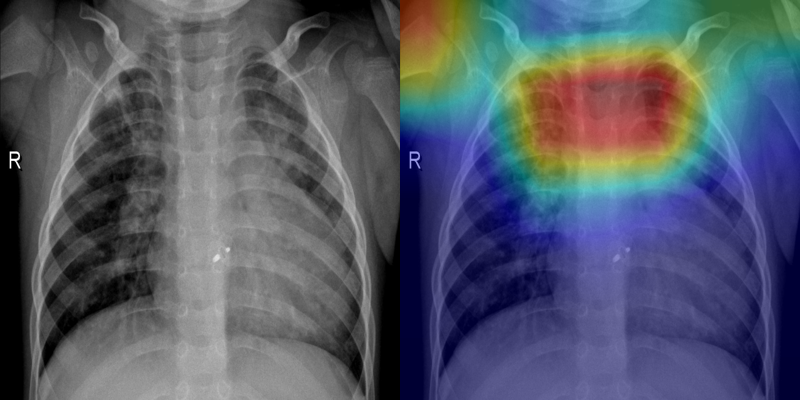
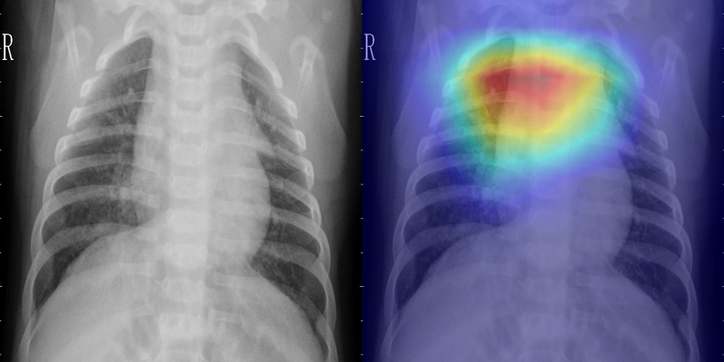
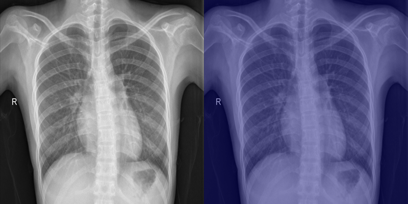
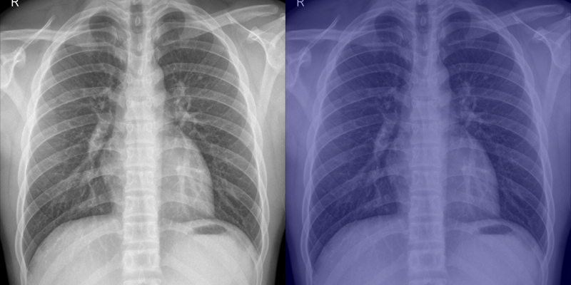
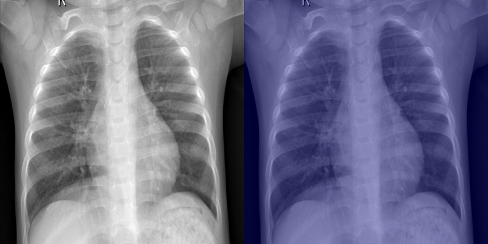

# AI-Powered Pneumonia Triage & Saliency Clinical Analysis System

An end-to-end medical AI application for automated Chest X-Ray classification, Grad-CAM visual saliency heatmap generation, and Gemini AI-assisted clinical diagnostic reporting.

---

## Sample Visual Results (Grad-CAM Saliency & Heatmap Analysis)

Below are sample inference results generated by the model on test Chest X-Ray scans. Each result shows the Original Chest X-Ray alongside its corresponding Grad-CAM Saliency Heatmap Overlay, highlighting affected pulmonary regions for radiological triage.

### Pneumonia Positive Cases

| Scan Description | Prediction | Confidence | Dominant Quadrant | Visual Comparison (Original \| Grad-CAM Overlay) |
| :--- | :---: | :---: | :---: | :---: |
| **Bacterial Pneumonia** (`person1002_bacteria_2933.jpeg`) | **PNEUMONIA** | **99.81%** | Right Upper Lobe |  |
| **Viral Pneumonia** (`person1007_virus_1690.jpeg`) | **PNEUMONIA** | **98.00%** | Right Upper Lobe |  |

---

### Normal Control Cases

| Scan Description | Prediction | Confidence | Dominant Quadrant | Visual Comparison (Original \| Grad-CAM Overlay) |
| :--- | :---: | :---: | :---: | :---: |
| **Normal Chest X-Ray** (`IM-0028-0001.jpeg`) | **NORMAL** | **0.39%** | Clear / None |  |
| **Normal Chest X-Ray** (`IM-0029-0001.jpeg`) | **NORMAL** | **0.01%** | Clear / None |  |
| **Normal Chest X-Ray** (`IM-0079-0001.jpeg`) | **NORMAL** | **3.27%** | Clear / None |  |

---

## Key Features

- **Chest X-Ray Pneumonia Triage**: Deep learning inference powered by PyTorch to detect pneumonia indicators from uploaded medical images.
- **Visual Saliency Heatmaps (Grad-CAM)**: Generates visual saliency overlay maps highlighting regions of interest (lung opacities/infiltrates) for radiological review.
- **AI Clinical Report Generator**: Integrates Google Gemini AI (`google-genai`) to synthesize findings into structured clinical notes, risk assessments, and recommendations.
- **Modern Medical Dashboard**: React 19 + Vite + Tailwind CSS interface featuring interactive PACS viewport controls, visual opacity adjustments, triage status HUD, and report generation.

---

## Tech Stack

### Backend
- **Framework**: [FastAPI](https://fastapi.tiangolo.com/) (Python 3.10+)
- **Machine Learning**: [PyTorch](https://pytorch.org/), `torchvision`
- **Image Processing**: OpenCV (`opencv-python-headless`), PIL (`Pillow`), NumPy
- **Generative AI**: Google GenAI SDK (`google-genai`)
- **Environment Management**: `python-dotenv`

### Frontend
- **Framework**: [React 19](https://react.dev/) + [Vite](https://vitejs.dev/)
- **Styling**: [Tailwind CSS v4](https://tailwindcss.com/)
- **Icons & UI**: Lucide React (`lucide-react`), Tailwind Merge, CLSX
- **Markdown Rendering**: `react-markdown`

---

## Repository Structure

```
HCA_project/
├── backend/
│   ├── model/
│   │   └── best_model.pth        # Pretrained PyTorch model weights
│   ├── .env.example              # Environment variables template
│   ├── inference_core.py         # PyTorch model inference & Grad-CAM generation
│   ├── main.py                   # FastAPI REST API endpoints
│   ├── report_generator.py       # Gemini AI clinical report synthesis
│   └── requirements.txt          # Python dependencies
├── docs/
│   └── results/                  # Generated sample Grad-CAM heatmap overlays
├── frontend/
│   ├── public/                   # Static assets & icons
│   ├── src/
│   │   ├── components/           # React UI components (PACS viewport, Saliency viewer, HUD, Reports)
│   │   ├── App.jsx               # Main application orchestration
│   │   ├── index.css             # Design tokens & Tailwind imports
│   │   └── main.jsx              # React entry point
│   ├── package.json              # Frontend package dependencies
│   └── vite.config.js            # Vite bundler configuration
├── testimages/                   # Sample anonymized Chest X-Ray test images
├── pneumonia-triage-system.ipynb  # Jupyter notebook for model training & evaluation
├── .gitignore                    # Excludes secrets, build output & dependencies
└── README.md                     # Project documentation
```

---

## Getting Started

### Prerequisites
- **Python**: `3.10` or higher
- **Node.js**: `18.0` or higher (with `npm`)
- **Google Gemini API Key**: Obtainable from [Google AI Studio](https://aistudio.google.com/)

---

### 1. Backend Setup

1. Navigate to the `backend/` directory:
   ```bash
   cd backend
   ```

2. Create and activate a Python virtual environment:
   ```bash
   python -m venv venv
   # On Windows (PowerShell):
   .\venv\Scripts\Activate.ps1
   # On macOS/Linux:
   source venv/bin/activate
   ```

3. Install required dependencies:
   ```bash
   pip install -r requirements.txt
   ```

4. Configure environment variables:
   Copy `.env.example` to `.env` and insert your Gemini API key:
   ```bash
   cp .env.example .env
   ```
   Edit `.env`:
   ```env
   GEMINI_API_KEY=your_gemini_api_key_here
   ```

5. Start the FastAPI development server:
   ```bash
   uvicorn main:app --reload --port 8000
   ```
   The backend API will be running at `http://localhost:8000`.

---

### 2. Frontend Setup

1. Open a new terminal and navigate to the `frontend/` directory:
   ```bash
   cd frontend
   ```

2. Install Node packages:
   ```bash
   npm install
   ```

3. Start the Vite development server:
   ```bash
   npm run dev
   ```

4. Open `http://localhost:5173` in your browser to launch the application.

---

## Security Notice

- `backend/.env` containing sensitive API keys is excluded from version control via `.gitignore`.
- Always store secrets in your local `.env` file and never commit API keys publicly.

---

## License

This project is created for educational and research purposes in clinical AI decision support systems.
